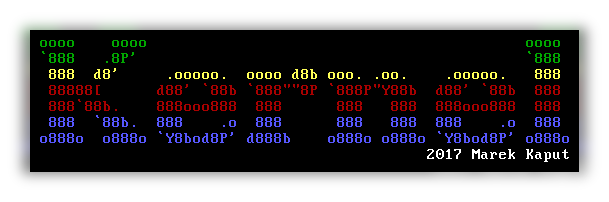

# Kernel

Playing with OSDev in Rust for x86-64 arch. This is also my project for Advanced Digital Systems class at AGH UST, there are scratches of documentation in [book].

## License

See the [LICENSE] file for license rights and limitations (MIT).

[LICENSE]: https://github.com/mkaput/kernel/blob/master/LICENSE.txt
[book]: https://github.com/mkaput/kernel/blob/master/book/
