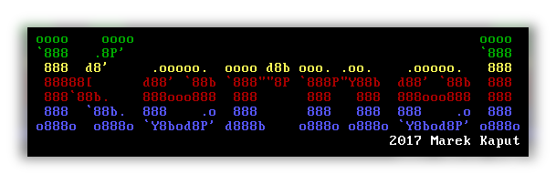

# Foundation of general purpose x86-64 operating system

The goal of this project is to write some elementary parts of PC operating system. **Rust** will be used as main programming language, with some parts also done in assembly (**NASM**). As bootloader **GRUB 2** will be used, which implements **Multiboot 2.0** standard. This enables easy creation of LiveCD/USB images.
