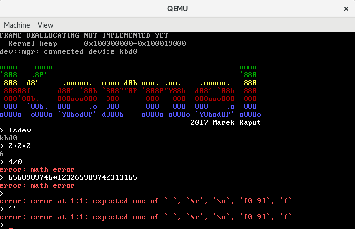

# Kernel Shell

The Kernel Shell is quick showcase of kernel features. Shell supports two operations:

- listing available devices, using `lsdev` command
- evaluating simple math expressions, involving `+`, `-`, `*` and `/` operations (note that `atkbd` driver does not support modifier keys, but it is possible to write input using numeric pad)
